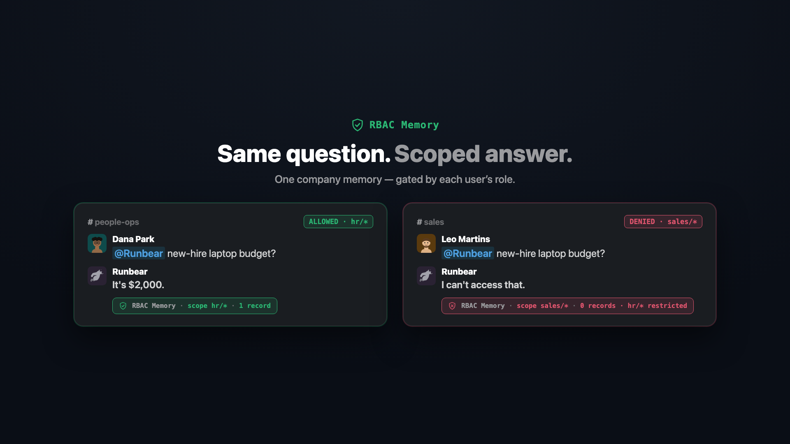

<h1 align="center">RBAC Memory Layer</h1>

<p align="center">
  <em>Role-based access control for AI agent memory — drop it in front of any agent.</em>
</p>

<p align="center">
  <!-- thumbnail: drop thumbnail.png in the repo root -->
  
</p>

https://github.com/user-attachments/assets/9545613d-4248-4d5a-a094-d2af546ed758

## Why

One of the first questions enterprises ask before adopting an AI agent is:
**"Can we control access *within* the team?"** The moment Sales, HR, and CS share
one bot, everything the agent remembers lands in a single store and surfaces to
everyone — regardless of who should see it. For our largest customer this was the
single biggest adoption blocker.

This project is an **open-source access-control layer** you can attach to any
commercial agent (Runbear, hermes, …) so memories stay scoped to the roles that
own them.

## The model — two rules, no magic

A memory has one **scope** (a path like `customer/acme/team/sales`). A role lists
the scopes it may read and write:

- **Read** a memory **iff** its scope ∈ the caller's `readableScopes`
- **Write** a memory **iff** its scope ∈ the caller's `writableScopes` (else denied, with a reason)

Enforcement lives in the layer, not the agent — so a prompt can't talk its way
past it.

## What's in here

| Package | What it is |
| --- | --- |
| [`bounded-contexts/rbac-memory`](bounded-contexts/rbac-memory) | The core layer: policy evaluation, scope matching, and pluggable memory stores (local FS, Mem0, SQLite-backed permissions, vector search). |
| [`apps/rbac-memory-demo`](apps/rbac-memory-demo/README.md) | Admin console + HTTP API + MCP server over the same enforcement path. Manage orgs, users, roles, and memories; verify isolation in an access playground. |
| [`apps/discord-rbac-dashboard`](apps/discord-rbac-dashboard/README.md) | Standalone dashboard that groups **real Discord server members** into teams — for external agents / Discord bots like `hermes`. |

## Quickstart

```sh
bun install
```

**Admin console + API + MCP** (http://localhost:4321):

```sh
bun run --cwd apps/rbac-memory-demo start
```

**Discord dashboard** (http://localhost:4322): set `DISCORD_BOT_TOKEN` and
`DISCORD_GUILD_ID` in `.env`, then:

```sh
bun run --cwd apps/discord-rbac-dashboard start
```

See each app's README for the full setup (Discord needs the bot's *Server Members
Intent* enabled).

## See it work

- Two roles share one store, yet **role A and role B get different search results**.
- A write to a scope outside a role's `writableScopes` is **denied with a reason**.
- In the dashboards, **assign Slack/Discord members to teams** to define who can
  access what — a person can belong to multiple teams.

## Verify

```sh
bun run --cwd bounded-contexts/rbac-memory test
bun run --cwd apps/rbac-memory-demo test
bun run --cwd apps/discord-rbac-dashboard test
bun run --cwd apps/discord-rbac-dashboard type-check
```

## Stack

Bun · TypeScript · `Bun.serve` · `bun:sqlite`. No framework, no build step.
